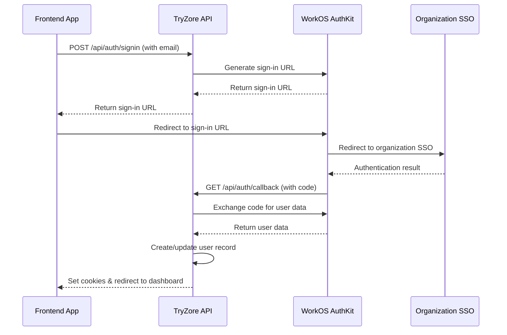

# TryZore B2B CRM API Integration Guide

## Overview

The TryZore B2B CRM API provides a comprehensive backend solution for fitness gym management with multi-tenant architecture, enterprise SSO, and mobile-first design. This guide will help you integrate with our API effectively.

## Base URL

- **Development**: `http://localhost:3000`
- **Staging**: `https://staging-api.tryzore.com`
- **Production**: `https://api.tryzore.com`

## Authentication

### WorkOS Enterprise SSO Integration

Our API uses WorkOS AuthKit for enterprise-grade authentication with SSO support.

#### Authentication Flow



#### Step 1: Initiate Sign-in

```javascript
// POST /api/auth/signin
const response = await fetch('/api/auth/signin', {
  method: 'POST',
  headers: {
    'Content-Type': 'application/json',
  },
  body: JSON.stringify({
    email: 'manager@fitnessgym.com' // Optional email hint
  })
});

const { url } = await response.json();
window.location.href = url; // Redirect to WorkOS
```

#### Step 2: Handle Authentication

After successful authentication, users are automatically redirected to `/dashboard` with secure httpOnly cookies set:

- `wos-session`: Encrypted WorkOS session data
- `current-user-id`: Current user identifier for fallback lookups

#### Step 3: Making Authenticated Requests

All API requests automatically include cookies. No additional headers needed:

```javascript
// Cookies are automatically included
const response = await fetch('/api/clients', {
  method: 'GET',
});

if (response.status === 401) {
  // Redirect to authentication
  window.location.href = '/';
}
```

#### Step 4: Sign Out

```javascript
// POST /api/auth/signout
const response = await fetch('/api/auth/signout', {
  method: 'POST',
});

// User will be redirected to sign-in page
```

### Multi-Organization Support

Users can belong to multiple organizations (gym locations or franchise groups):

```javascript
// Switch active organization context
const response = await fetch('/api/auth/switch-organization', {
  method: 'POST',
  headers: {
    'Content-Type': 'application/json',
  },
  body: JSON.stringify({
    organizationId: '123e4567-e89b-12d3-a456-426614174000'
  })
});

const result = await response.json();
console.log('Now working with:', result.data.organizationName);
```

## API Standards

### Request Format

- **Content-Type**: `application/json`
- **Character Encoding**: UTF-8
- **Date Format**: ISO 8601 (`2023-12-01T18:45:00.000Z`)
- **UUID Format**: RFC 4122 (`123e4567-e89b-12d3-a456-426614174000`)

### Response Format

All successful responses follow this structure:

```json
{
  "success": true,
  "data": {
    // Response payload
  }
}
```

### Error Handling

Errors follow RFC 7807 Problem Details format:

```json
{
  "error": "Human-readable error message",
  "code": "MACHINE_READABLE_CODE",
  "details": {
    "field": "validation_field",
    "value": "invalid_value"
  }
}
```

#### Common HTTP Status Codes

- **200**: Success
- **400**: Bad Request (validation error)
- **401**: Unauthorized (authentication required)
- **403**: Forbidden (insufficient permissions)
- **404**: Not Found
- **405**: Method Not Allowed
- **429**: Too Many Requests (rate limited)
- **500**: Internal Server Error

## Pagination

All list endpoints support pagination:

### Query Parameters

- `page`: Page number (default: 1)
- `limit`: Items per page (default: 20, max: 100)

### Response Format

```json
{
  "success": true,
  "data": {
    "clients": [...],
    "pagination": {
      "page": 1,
      "limit": 20,
      "total": 150,
      "totalPages": 8,
      "hasNext": true,
      "hasPrev": false
    }
  }
}
```

### Implementation Example

```javascript
async function fetchClients(page = 1, limit = 20) {
  const response = await fetch(
    `/api/clients?page=${page}&limit=${limit}`
  );
  return await response.json();
}

// Load next page
async function loadNextPage(currentPagination) {
  if (currentPagination.hasNext) {
    return await fetchClients(currentPagination.page + 1);
  }
}
```

## Client Management

### List Clients

```javascript
// Basic client list
const clients = await fetch('/api/clients');

// With search and filters
const filteredClients = await fetch(
  '/api/clients?' + new URLSearchParams({
    search: 'john',
    status: 'active',
    sort: 'last_visit',
    order: 'desc',
    page: 1,
    limit: 20
  })
);
```

### Search and Filtering

Available filters:
- `search`: Search in name/email (minimum 2 characters)
- `status`: Filter by membership status (`active`, `inactive`, `pending`, `suspended`, `expired`)
- `sort`: Sort field (`name`, `email`, `status`, `joined`, `last_visit`, `created`)
- `order`: Sort order (`asc`, `desc`)

## Organization Management

### Current Organization Context

All API calls are scoped to the user's active organization. Data is automatically isolated using Row-Level Security (RLS).

```javascript
// All clients returned belong to user's active organization
const response = await fetch('/api/clients');
```

### Switch Organization Context

```javascript
async function switchOrganization(organizationId) {
  try {
    const response = await fetch('/api/auth/switch-organization', {
      method: 'POST',
      headers: { 'Content-Type': 'application/json' },
      body: JSON.stringify({ organizationId })
    });
    
    if (response.ok) {
      const result = await response.json();
      console.log(`Switched to: ${result.data.organizationName}`);
      // Refresh current page data
      location.reload();
    }
  } catch (error) {
    console.error('Failed to switch organization:', error);
  }
}
```

## Rate Limiting

API endpoints are rate-limited to prevent abuse:

- **Per User**: 100 requests per minute
- **Per IP**: 1000 requests per minute
- **Burst**: 10 requests per second

### Headers

Rate limit information is included in response headers:

```
X-RateLimit-Limit: 100
X-RateLimit-Remaining: 95
X-RateLimit-Reset: 1640995200
```

### Handling Rate Limits

```javascript
async function makeRequest(url, options = {}) {
  const response = await fetch(url, options);
  
  if (response.status === 429) {
    const resetTime = response.headers.get('X-RateLimit-Reset');
    const waitTime = (resetTime * 1000) - Date.now();
    
    console.log(`Rate limited. Waiting ${waitTime}ms`);
    await new Promise(resolve => setTimeout(resolve, waitTime));
    
    // Retry request
    return makeRequest(url, options);
  }
  
  return response;
}
```

## Security Best Practices

### HTTPS Only

Always use HTTPS in production. HTTP requests will be rejected.

### Cookie Security

- Session cookies are `httpOnly` and cannot be accessed via JavaScript
- Cookies use `SameSite=Lax` for CSRF protection
- Cookies are `Secure` in production (HTTPS only)

### Input Validation

All inputs are validated server-side:

```javascript
// Good: Validate client-side too for UX
function validateEmail(email) {
  const regex = /^[^\s@]+@[^\s@]+\.[^\s@]+$/;
  return regex.test(email);
}

// Backend will also validate - don't skip server validation
```

### Organization Isolation

- Users can only access data from their active organization
- Row-Level Security (RLS) enforces data isolation at database level
- No need to include organization ID in requests - it's handled automatically

## Error Handling Best Practices

### Client-Side Error Handling

```javascript
async function apiCall(endpoint, options = {}) {
  try {
    const response = await fetch(endpoint, {
      headers: {
        'Content-Type': 'application/json',
        ...options.headers
      },
      ...options
    });

    // Handle authentication errors
    if (response.status === 401) {
      window.location.href = '/auth';
      return;
    }

    // Handle rate limiting
    if (response.status === 429) {
      throw new Error('Too many requests. Please wait and try again.');
    }

    // Parse response
    const data = await response.json();

    // Handle API errors
    if (!response.ok) {
      throw new Error(data.error || `HTTP ${response.status}`);
    }

    return data;
  } catch (error) {
    console.error('API call failed:', error);
    throw error;
  }
}
```

### User-Friendly Error Messages

```javascript
function handleApiError(error) {
  const errorMessages = {
    'AUTH_REQUIRED': 'Please sign in to continue.',
    'ORG_ACCESS_DENIED': 'You don\'t have access to this organization.',
    'VALIDATION_FAILED': 'Please check your input and try again.',
    'RATE_LIMITED': 'Too many requests. Please wait a moment.',
  };

  const userMessage = errorMessages[error.code] || error.message;
  showNotification(userMessage, 'error');
}
```

## Mobile App Integration

### React Native Example

```javascript
import AsyncStorage from '@react-native-async-storage/async-storage';

class TryZoreAPI {
  constructor(baseURL) {
    this.baseURL = baseURL;
  }

  async makeRequest(endpoint, options = {}) {
    // Get session cookies from storage
    const sessionCookie = await AsyncStorage.getItem('session_cookie');
    
    const response = await fetch(`${this.baseURL}${endpoint}`, {
      ...options,
      headers: {
        'Content-Type': 'application/json',
        'Cookie': sessionCookie,
        ...options.headers
      },
      credentials: 'include'
    });

    // Save session cookies
    const cookies = response.headers.get('set-cookie');
    if (cookies) {
      await AsyncStorage.setItem('session_cookie', cookies);
    }

    return response;
  }

  async getClients(params = {}) {
    const query = new URLSearchParams(params);
    const response = await this.makeRequest(`/api/clients?${query}`);
    return await response.json();
  }
}

// Usage
const api = new TryZoreAPI('https://api.tryzore.com');
const clients = await api.getClients({ status: 'active', limit: 50 });
```

## Testing

### Development Environment

Use real data for testing:

```javascript
// Test with actual database data
const response = await fetch('http://localhost:3000/api/clients');
const data = await response.json();

console.log('Real clients:', data.data.clients.length);
```

### Postman Collection

Import our Postman collection for API testing:

```json
{
  "info": {
    "name": "TryZore B2B CRM API",
    "version": "1.0.0"
  },
  "auth": {
    "type": "noauth"
  },
  "item": [
    {
      "name": "Authentication",
      "item": [
        {
          "name": "Generate Sign-in URL",
          "request": {
            "method": "POST",
            "header": [
              {
                "key": "Content-Type",
                "value": "application/json"
              }
            ],
            "body": {
              "mode": "raw",
              "raw": "{\"email\": \"test@example.com\"}"
            },
            "url": {
              "raw": "{{baseUrl}}/api/auth/signin",
              "host": ["{{baseUrl}}"],
              "path": ["api", "auth", "signin"]
            }
          }
        }
      ]
    }
  ]
}
```

## Support and Documentation

### Interactive Documentation

Access live API documentation with examples:

- **Development**: `http://localhost:3000/api/docs/ui`
- **Production**: `https://api.tryzore.com/api/docs/ui`

### OpenAPI Specification

Download the OpenAPI 3.0 specification:

- **JSON**: `/api/docs`
- **YAML**: Contact support for YAML format

### Support

- **Documentation**: [docs.tryzore.com](https://docs.tryzore.com)
- **Support Email**: dev@tryzore.com
- **GitHub Issues**: [github.com/tryzore/api/issues](https://github.com/tryzore/api/issues)

---

*This guide is updated regularly. Check the timestamp in the API response headers for the latest version.*